# Grokking Algorithms Notes

## Content:

- Ch01 - Introduction to algorithms
- Ch02 - Selection sort
- Ch03 - Recursion
- Ch04 - Quicksort
- Ch05 - Hash tables
- Ch06 - Breadth-first search
- Ch07 - Dijkstra’s algorithm
- Ch08 - Greedy algorithm
- Ch09 - Dynamic programming
- Ch10 - K-nearest neighbors
- Ch11 - Where to go next

## Chapter 01: Introduction to algorithms

Some common Big O run times sorted from fastest to slowest:

- O(log n), also known as log time. Example: Binary search.
- O(n), also known as linear time. Example: Simple search.
- O(n \* log n). Example: A fast sorting algorithm, like quicksort.
- O(n2). Example: A slow sorting algorithm, like selection sort.
- O(n!). Example: A really slow algorithm, like the traveling Salesperson.

**Recap**

- Binary search is a lot faster than simple search.
- O(log n) is faster than O(n), but it gets a lot faster once the list of items you’re searching through grows.
- Algorithm speed isn’t measured in seconds.
- Algorithm times are measured in terms of growth of an algorithm.
- Algorithm times are written in Big O notation.

## Chapter 02: Selection Sort

- Linked lists are great if you’re going to read all the items one at a time.
- Arrays are great if you want to read random elements.
- Lists are better if you want to insert elements into the middle.
- A lot of use cases require random access, so arrays are used a lot. Arrays and lists are used to implement other data structures.
- Selection sort is a neat algorithm, but it’s not very fast. Quicksort is a faster sorting algorithm that only takes O(n log n) time.

**Recap**

- When you want to store multiple elements, use an array or a list.
- With an array, all your elements are stored right next to each other.
- With a list, elements are strewn all over, and one element stores the address of the next one.
- Arrays allow fast reads.
- Linked lists allow fast inserts and deletes.
- All elements in the array should be the same type (all ints, all doubles, and so on).

```python
# A simple Selection sort Algorithm
def findSmallest(arr):
    smallest = arr[0]
    smallest_index = 0
    for i in range(1, len(arr)):
        if arr[i] < smallest:
            smallest =arr[i]
            smallest_index = i
    return smallest_index

def selectionSort(arr):
    new_arr = []
    for i in range(len(arr)):
        smallest = findSmallest(arr)
        new_arr.append(arr.pop(smallest))
    return new_arr

if __name__ == '__main__':
    arr = list(map(int, input().split()))
    print(selectionSort(arr))
```

## Chapter 03: Recursion

- Pseudo code is a high-level description of the problem you’re trying to solve, in code. It’s written like code, but it’s meant to be closer to human speech.
- Recursion is where a function calls itself.
- Quote by Leigh Caldwell on Stack Overflow:

  "Loops may achieve a performance gain for your program. Recursion may achieve a performance gain for your programmer. Choose which is more important in your situation!"

- every recursive function has two parts: the base case, and the recursive case.

<p align="center"> 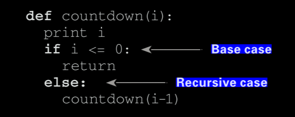 </p>

- Using the stack is convenient because you don’t have to keep track of a pile of boxes yourself—the stack does it for you. but there’s a cost: saving all that info can take up a lot of memory.

**Recap**

- Recursion is when a function calls itself.
- Every recursive function has two cases: the base case and the recursive case.
- A stack has two operations: push and pop.
- All function calls go onto the call stack.
- The call stack can get very large, which takes up a lot of memory.

## Chapter 04: Quicksort

- Quicksort is a sorting algorithm, and a much faster one than selection sort.
- To solve a problem using D&C, there are two steps:
  1. Figure out the base case. This should be the simplest possible case.
  2. Divide or decrease your problem until it becomes the base case.
- Remember, recursion keeps track of the state.
- When you’re writing a recursive function involving an array, the base case is often an empty array or an array with one element. If you’re stuck, try that first.

**Recap**

- D&C works by breaking a problem down into smaller and smaller pieces. If you’re using D&C on a list, the base case is probably an empty array or an array with one element.
- If you’re implementing quicksort, choose a random element as the pivot. The average runtime of quicksort is O(n log n)!
- The constant in Big O notation can matter sometimes. That’s why quicksort is faster than merge sort.
- The constant almost never matters for simple search versus binary search, because O(log n) is so much faster than O(n) when your list gets big.

## Chapter 05: Hash Tables

- Using hash tables for lookups
  Hash tables are great when you want to
  - Create a mapping from one thing to another thing
  - Look something up
- Preventing duplicate entries.

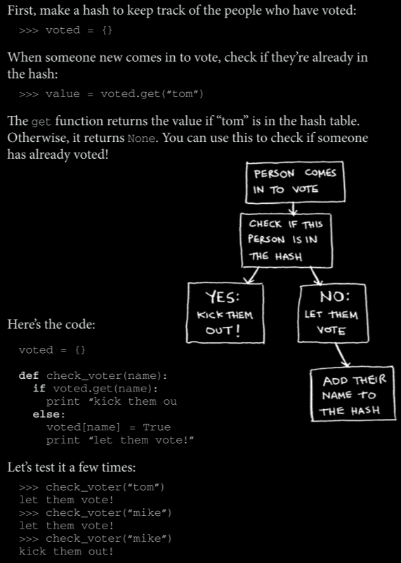

- Using hash tables as a cache.

  you’d just remember and answer. This is how caching works: websites remember the data instead of recalculating it.

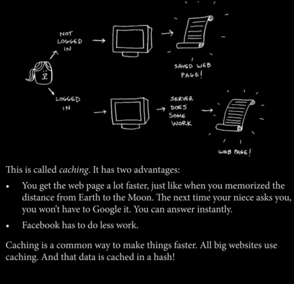

When you visit a page on Facebook, it first checks whether the page is stored in the hash.

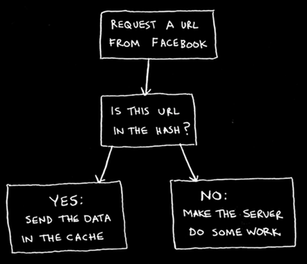

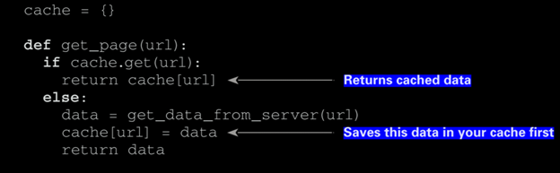

**Recap**

To recap, hashes are good for

- Modeling relationships from one thing to another thing.
- Filtering out duplicates.
- Caching/memorizing data instead of making your server do work.

**Collisions**

Definition: an event of two or more records being assigned the same identifier or location in memory.

Simplest way to deal with collisions is this: if multiple keys map to the same slot, start a linked list at that slot.
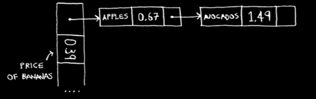
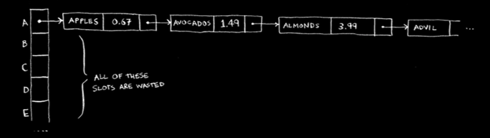
There is a problem here, The entire hash table is totally empty except for one slot. And that slot has a giant linked list! Every single element in this hash table is in the linked list. That’s as bad as putting everything in a linked list to begin with. It’s going to slow down your hash table.

> _A good hash function will give you very few collisions._

**Performance**

In the average case, hash tables take O(1) for everything. O(1) is called constant time. You haven’t seen constant time before. It doesn’t mean instant. It means the time taken will stay the same, regardless of how big the hash table is.

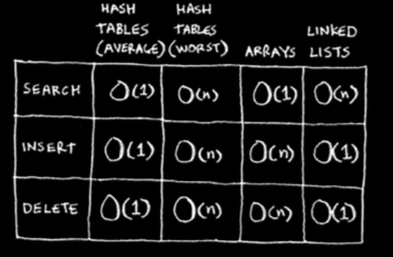

It’s important that you don’t hit worst-case performance with hash tables. And to do that, you need to avoid collisions.

To avoid collisions, you need

- A low load factor.
- A good hash function.

**Load factor**

Load factor measures how many empty slots remain in your hash table

<p align="center">
  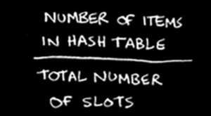
&nbsp; &nbsp;&nbsp;
  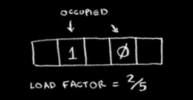
</p>

Having a load factor greater than 1 means you have more items than slots in your array.

Once the load factor starts to grow, you need to add more slots to your hash table. This is called _resizing_.

> A good rule of thumb is, resize when your load factor is greater than 0.7.

**A good hash function:**

- A good hash function distributes values in the array evenly.
<p align="center">
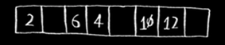
</p>

- A bad hash function groups values together and produces a lot of collisions.
<p align="center">
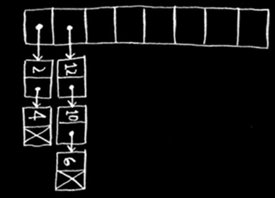
</p>

**Recap**

You’ll almost never have to implement a hash table yourself. The programming language you use should provide an implementation for you. You can use Python’s hash tables and assume that you’ll get the average case performance: constant time.
Hash tables are a powerful data structure because they’re so fast and they let you model data in a different way. You might soon find that you’re using them all the time:

- You can make a hash table by combining a hash function with an array.
- Collisions are bad. You need a hash function that minimizes collisions.
- Hash tables have really fast search, insert, and delete.
- Hash tables are good for modeling relationships from one item to another item.
- Once your load factor is greater than .07, it’s time to resize your hash table.
- Hash tables are used for caching data (for example, with a web server).
- Hash tables are great for catching duplicates.

## Chapter 05: Breadth-First Search (BFS)

Breadth-first search is a different kind of search algorithm: one that runs on graphs.

### It can help answer two types of questions:

- Question type 1: Is there a path from node A to node B?
- Question type 2: What is the shortest path from node A to node B?

**Implementing the graph:**

A graph consists of several nodes. And each node is connected to neighboring nodes.

Here’s how you’d write it in Python:

```python
# def
graph = {}
graph["you"] = ["alice", "bob", "claire"]
```

A graph is just a bunch of nodes and edges.

```python
graph = {}
graph["you"] = ["alice", "bob", "claire"]
graph["bob"] = ["anuj", "peggy"]
graph["alice"] = ["peggy"]
graph["claire"] = ["thom", "jonny"]
graph["anuj"] = []
graph["peggy"] = []
graph["thom"] = []
graph["jonny"] = []
```

**Implementing the algorithm:**

1. Keep a queue containing the people to check.
2. Pop a person off the queue.
3. Check if this Person is for ex: “a mango seller”.
4. a. if yes → you’re done.

   b. if no → add all their neighbors to the queue.

5. Loop.
6. If the queue is empty, there are no “mango sellers” in your network.

And so on. The algorithm will keep going until either

- A mango seller is found, or
- The queue becomes empty, in which case there is no mango seller.

Here’s the final code for breadth-first search, taking that into account:

```python
def search(name):
    search_queue = deque()
    search_queue += graph[name]
    searched = []
    while search_queue:
        person = search_queue.popleft()
        if not person in searched:
            if person_is_seller(person):
                print person + “ is a mango seller!”
                return True
            else:
                search_queue += graph[person]
                searched.append(person)
    return False

search(“you”)
```

**Topological sort:** it’s a way to make an ordered list out of a graph.

**A tree** is a special type of graph, where no edges ever point back.

**Recap**

- Breadth-first search tells you if there’s a path from A to B.
- If there’s a path, breadth-first search will find the shortest path.
- If you have a problem like “find the shortest X,” try modeling your problem as a graph, and use breadth-first search to solve.
- A directed graph has arrows, and the relationship follows the direction of the arrow (Rama -> Adit means “Rama owes Rdit money”).
- Undirected graphs don’t have arrows, and the relationship goes both ways (ross - Rachel means “Ross dated Rachel and Rachel dated Ross”).
<p align="center">
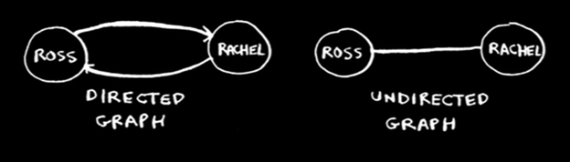
</p>

- Queues are FIFO (First In, First Out).
- Stacks are LIFO (Last In, First Out).
- You need to check people in the order they were added to the search list, so the search list needs to be a queue. Otherwise, you won’t get the shortest path.
- Once you check someone, make sure you don’t check them again. Otherwise, you might end up in an infinite loop.
