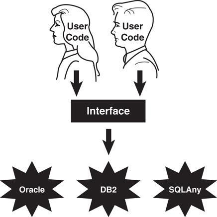

# The Object-Oriented Thought Process

## Fifth Edition

by **Matt Weisfeld**

# Introduction

## THIS BOOK’S SCOPE

Learning OO concepts is not accomplished by learning a specific development method, a programming language, or a set of design tools. Object-oriented development is, simply put, a way of thinking. This book is all about the OO thought process.

Separating the languages, development practices, and tools from the OO thought process is not an easy task. Often, people are introduced to OO concepts by diving headfirst into a programming language.

It is important to understand the significant difference between learning OO concepts and programming in an OO language.

## THE INTENDED AUDIENCE

The intended audience for this book includes business managers, designers, developers, programmers, and project managers: in short, anyone who wants to gain a general understanding of what object orientation is all about.

### > **The five SOLID principles are**

- **SRP**—Single Responsibility Principle
- **OCP**—Open/Close Principle
- **LSP**—Liskov Substitution Principle
- **IPS**—Interface Segregation Principle
- **DIP**—Dependency Inversion Principle

# Chapter 01 - Introduction To The Object-Oriented Concepts

Technologies change very quickly in the software industry, whereas concepts evolve.

## THE FUNDAMENTAL CONCEPTS

- ### Encapsulation
- ### Inheritance
- ### Polymorphism
- ### Composition

## OBJECTS AND LEGACY SYSTEMS

As OO moved into the mainstream, one of the issues facing developers was the integration of new OO technologies with existing systems.
Lines were being drawn between OO and structured (or procedural) programming, which was the dominant development paradigm at the time.

Object-Oriented code is not meant to replace structured code. Many non-OO legacy systems (that is, older systems that are already in place) are doing the job quite well, so why risk potential disaster by changing or replacing them? In most cases you should not change them, at least not for the sake of change.

The explosion of transactions performed on browsers and mobile apps has opened up brand-new markets, where much of the software development is new and mostly unencumbered by legacy concerns. Even when there are legacy concerns, there is a trend to wrap the legacy systems in object wrappers.

> **Object Wrappers**
>
> Object wrappers are object-oriented code that includes other code inside. For example, you can take structured code (such as loops and conditions) and wrap it inside an object to make it look like an object. You can also use object wrappers to wrap functionality such as security features, nonportable hardware features, and so on.

**_Developers who can combine the skills of mainframe and mobile web development are in demand._**

> **Mobile Web**
>
> In this book, the term mobile web will be used in the context of concepts that pertain to both mobile app development and web development. The term hybrid app is sometimes used to refer to applications that render in browsers on both web and mobile devices.

## PROCEDURAL VERSUS OO PROGRAMMING

Before we delve deeper into the advantages of OO development, let’s consider a more fundamental question: What exactly is an object?

In its basic definition, an object is an entity that contains both data and behavior

# Chapter 02 - How to Think in Terms of Objects

Three important things you can do to develop a good sense of the OO thought process are
covered in this chapter:

1. Knowing the difference between the interface and implementation
2. Thinking more abstractly
3. Giving the user the minimal interface possible

### **Knowing the difference between the interface and implementation**

> As a general rule, the interface to a class should contain only what the user needs to know

> A change to the implementation should not require a change to the user’s code

> Remember that the interface includes the syntax to call a method and return a value. If this interface does not change, the user does not care whether the implementation is changed. As long as the programmer can use the same syntax and retrieve the same value, that’s all that matters.

> You add interfaces only when it is requested. Never assume that the user needs something.

> **_Object persistence_** refers to the concept of saving the state of an object so that it can be restored and used at a later time. An object that does not persist basically dies when it goes out of scope.

By separating the user interface from the implementation, we can save a lot of headaches down
the road. In the figure below the database implementations are transparent to the end users, who see only the interface.

> One of the main advantages of OO programming is that classes can be reused. In general, reusable classes tend to have interfaces that are more abstract than concrete. Concrete interfaces tend to be very specific, whereas abstract interfaces are more general.

### **Providing The Absolute Minimal user Interface Possible**

When designing a class, the general rule is to always provide the user with as little knowledge of
the inner workings of the class as possible.

To accomplish this, follow these simple rules:

- Give the users only what they absolutely need.
- It is better to have to add interfaces because users really need it than to give the users
  more interfaces than they need.
- Public interfaces define what the users can access.
- It is vital to design classes from a user’s perspective and not from an information
  systems viewpoint.
- Make sure when you are designing a class that you go over the requirements and the
  design with the people who will actually use it.

### Determining the Users

> In reality, to build a realistic and usable interface, both the customer and the cabbie must be considered users.

### Object Behavior

> Begin identifying the purpose of each object and what it must do to perform properly.

### Environmental Constraints

> In fact, environmental constraints are almost always a factor. Computer hardware might limit software functionality

### Identifying the Public Interfaces

> Initially, you think about how the object is used and not how it is built.

> For each interface, you must determine whether the interface contributes to the operation of the object. If it does not, perhaps it is not necessary.

### Identifying the Implementation

> Technically, anything that is not a public interface can be considered the implementation.

> Any private method is considered part of the implementation given that the user will never see it and thus will not have access to it.

> The implementation is totally hidden from the user.

> Theoretically, anything that is considered the implementation might change without affecting how the user interfaces with the class.

> Interface represents how the user sees the object the implementation is really the nuts and bolts of the object.

## Conclusion

> Doing things in an OO way is more of an art than a science.

# Chapter 05 - Class Design Guidelines

This chapter presents several suggestions for designing classes. No list such as this can be considered complete.

> **Modeling Real-World Systems**
>
> One of the primary goals of object-oriented (OO) programming is to model real-world systems in ways similar to the ways in which people actually think. Designing classes is the object-oriented way to create these models.

- ### Keep the public interface to a minimum.
        The entire purpose of building a class is to provide something useful and concise. the interface of a well-designed object describes the services that the client wants accomplished. If a class does not provide a useful service to a user, it should not have been built in the first place.
- ### Hide The Implementation, Users of your code need to know nothing about its internal workings.

        A change to the implementation should not necessitate a change in the user’s application code.

- ### Designing Robust Constructors

        A constructor should put an object into an initial, safe state. You also need to make sure the object is constructed properly in the default condition.

  > **Memory Leaks**
  >
  > When an object fails to properly release the memory that it acquired during an object's life cycle, the memory is lost to the entire operating system as long as the application that created the object is executing.

- ### Designing Error Handling Into A Class

        It is not a good idea to ignore potential errors. The developer of a good class (or any code, for that matter) anticipates potential errors and includes code to handle these conditions when they are encountered.

        The general rule is that the application should never crash. When an error is encountered, the system should either fix itself and continue, or at minimum, exit gracefully without losing any data that’s important to the user.

- ### Documenting a Class and Using Comments

        A good design is practically impossible without good documentation practices.

        Too much documentation and/or commenting can become background noise and may actually defeat the purpose of the documentation.

- ### Building Objects with the Intent to Cooperate

        Almost no class lives in isolation. A class will service other classes; it will request the services of other classes, or both.
        When designing a class, make sure you are aware of how other objects will interact with it.

- ### Designing with Reuse In Mind

        Objects can be reused in different systems, and code should be written with reuse in mind.

- ### Designing with Extensibility In Mind

        It is not necessary to rewrite everything. This is where inheritance comes into play.
        If you have just written a Person class, you must consider the fact that you might later want to write an Employee class or a Customer class. Thus, having Employee inherit from Person might be the best strategy; in this case, the Person class is said to be extensible.

  > What Attributes and Methods Can Be Static
  >
  > Static methods promote strong coupling to classes. You cannot abstract a static method. You cannot mock a static method or static class. You cannot provide a static interface. The only time it is reasonable to use static classes is if you're working with some sort of helper class or extension method that does not produce side effects.

- ### Making Names Descriptive
- ### Abstracting Out Nonportable Code
- ### Designing With Maintainability in Mind

# Chapter 06 - Designing with Objects

This chapter focuses on designing good systems. A system can be defined as classes that interact with each other.

## A solid OO design process includes the following steps:

### 1. Performing the Proper Analysis

        The users must work hand in hand with the developers at all stages.
        In the analysis phase, the users and the developers must do the proper research and analysis to determine the statement of work, the requirements of the project, and whether to actually do the project.

### 2. Developing a Statement of Work

        The statement of work (SOW) is a document that describes the system.
        The SOW should give anyone who reads it a complete, high level understanding of the system.
        The SOW contains everything that must be known about the system.

### 3. Gathering the Requirements

- ### The requirements document describes what the users want the system to do.
- ### the requirements must be specific enough to represent the true nature of the user’s needs for the end product.
- ### The requirements document must be of sufficient detail for the user to make educated judgments about the completeness of the system.
- ### It must also be of specific detail for a design group to use the document to proceed with the design phase.
- ### The SOW might contain irrelevant material; however, the requirements are the final representation of the system that must be implemented.
- ### All future documents in the software development process will be based on the requirements.

### 4. Developing a System Prototype

        One of the best ways to make sure users and developers understand the system is to create a prototype.

        In any event, a prototype will almost certainly not contain all the functionality of the final system.

        Having a good prototype can help immensely when identifying classes.

### 5. Identifying the Classes

        one straightforward way of identifying classes is to highlight all the nouns.

        Don’t be too fussy about getting all the classes right the first time.

        Take advantage of the fact that the design is an iterative process.

### 6. Determining the Responsibilities of Each Class

        You need to determine the responsibilities of each class you have identified.

### 7. Determining How the Classes Collaborate with Each Other

        Most classes do not exist in isolation. Although a class must fulfill certain responsibilities, many times it will have to interact with another class to get something it wants.

### 8. Creating a Class Model to Describe the System

       A class model that represents the complete system can be constructed. The class model shows how the various classes interact within the system.

## Prototyping the User Interface in Code

        "to a system user, the user interface is the system"

        When you are developing a user interface prototype, make sure that the users have the final say on the look and feel.

## Object Wrappers

## Structured Code

## Wrapping Structured Code

## Wrapping Nonportable Code

## Conclusion

# Chapter 07- Mastering Inheritance and Composition

### Outline:

- Introduction
- Reusing Objects
- Inheritance
- Composition
- Why Encapulation is fundamental to OO
- Conclusion

---

## 1. Introduction

Inheritance and composition play major roles in the design of object-oriented (OO) systems.

Inheritance tends to be used often for data/models whereas implementation tends to be used for behaviors.

Many developers are even turning away from inheritance by implementing designs solely with composition

        The bottom line is that inheritance and composition are both important techniques in building OO systems. Designers and developers need to take the time to understand the strengths and weaknesses of both and to use each in the proper contexts.

## 2. Reusing Objects

Perhaps the primary reason why inheritance and composition exist is object reuse.

        Inheritance represents the is-a relationshi

        Composition represents a has-a relationship.
        Composition involves using other classes to build more complex classes.

        Interfaces are used even though they don’t provide all the functionality that abstract classes do.

## 3. Inheritance

        There is more to inheritance
